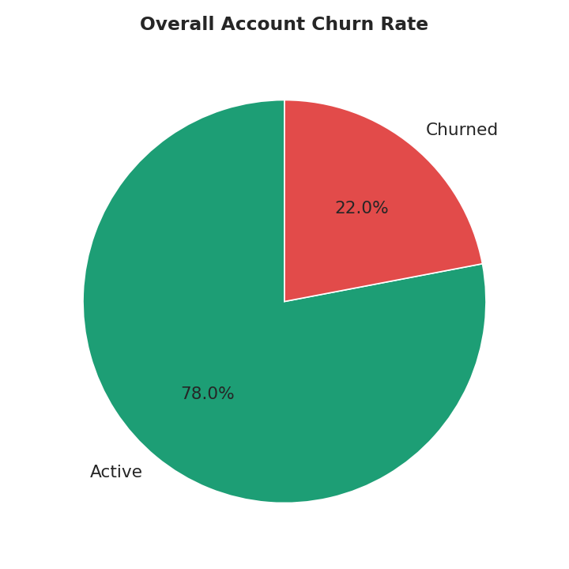
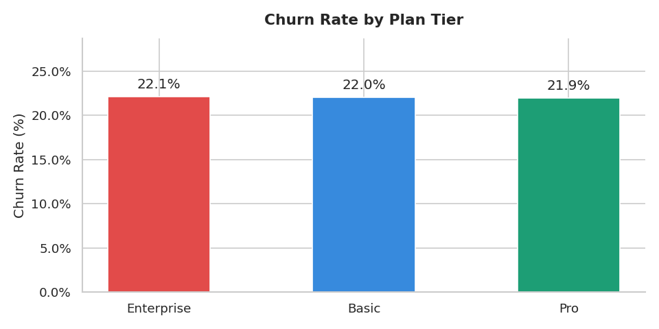
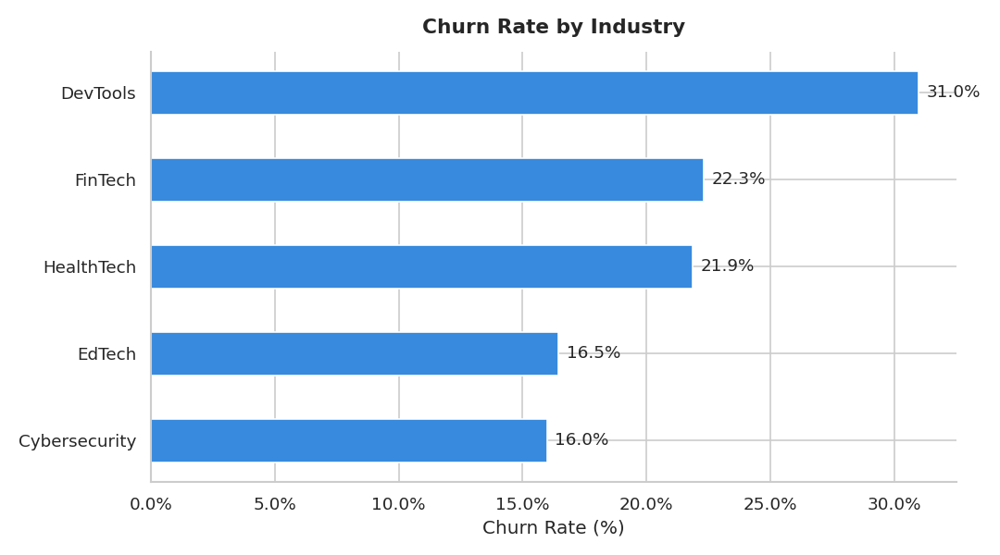
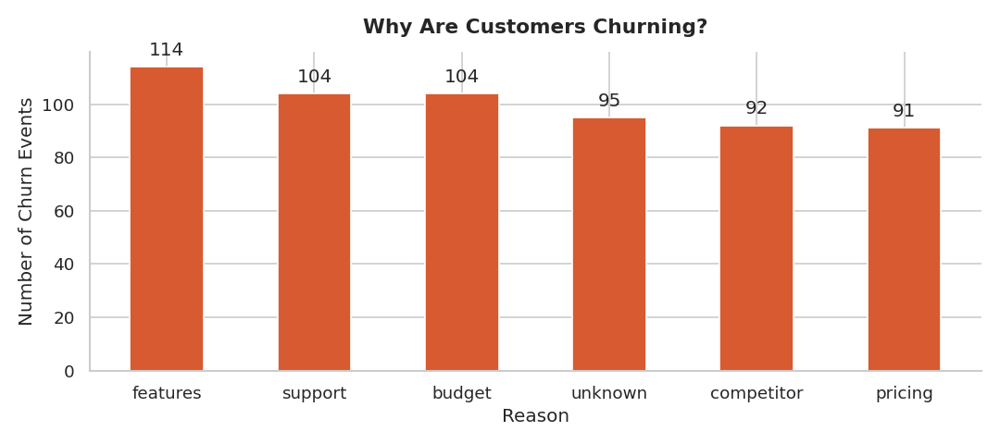
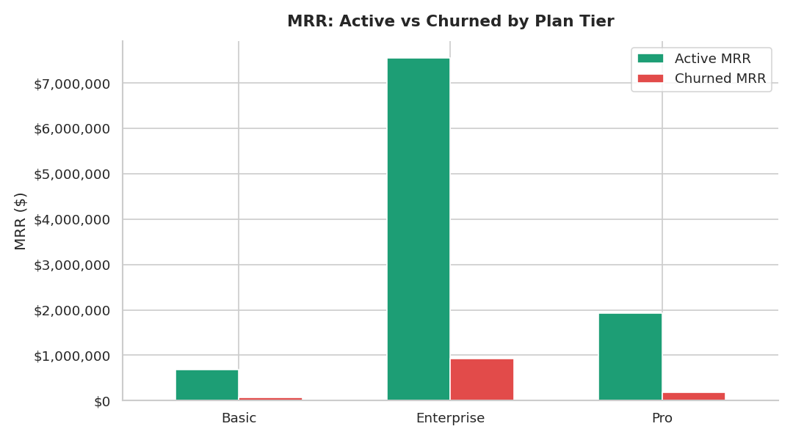
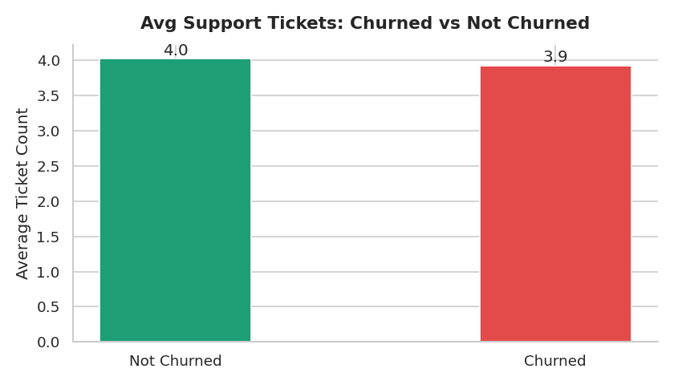

# SaaS Customer Churn Analysis

## 🧠 Problem Context

RavenStack, a B2B SaaS company, is losing customers at an alarming rate. Operational pressure builds when product gaps, support friction, and pricing misalignment compound across segments. Most reporting systems surface volume metrics but fail to explain **why churn persists** or **where revenue risk is highest**.

This project investigates who is churning, why, how much revenue is at risk, and which active accounts are most likely to leave next — using a full analytics pipeline across 5 relational tables and 32,600+ rows of data.

---

## 🎯 Objectives

- Clean and transform raw data across **5 relational tables** using Python and SQL
- Identify **which segments churn most** and quantify revenue at risk
- Understand **why customers leave** — not just that they do
- Build a **risk scoring model** to flag active accounts before they churn
- Deliver findings as **business recommendations**, not just numbers

---

## 🛠 Tools & Stack

| Layer | Tools |
|---|---|
| Data Cleaning & EDA | Python (Pandas, NumPy, Matplotlib, Seaborn) |
| Relational Analysis | PostgreSQL, pgAdmin |
| Version Control | Git, GitHub |

---

## 📁 Repository Structure
saas-churn-analysis/
│
├── 01_EDA_and_Cleaning.ipynb
│   # Data cleaning + 6 EDA charts (Python)
│
├── 02_SQL_Analysis.sql
│   # 5 tables, 3 views, 5 business queries (PostgreSQL)
│
├── images/
│   ├── churn_overall.png
│   ├── churn_by_plan.png
│   ├── churn_by_industry.png
│   ├── churn_reasons.png
│   ├── mrr_at_risk.png
│   └── tickets_vs_churn.png
│
└── README.md

---

## 🔄 How It Works

Raw CSV files across 5 tables (accounts, subscriptions, churn_events, feature_usage, support_tickets) were first cleaned in **Python** — fixing date types, handling meaningful nulls, and engineering derived columns. The cleaned data was then loaded into **PostgreSQL**, where 3 analytical views and 5 business queries were built progressively — from basic aggregations to multi-table joins, CTEs, and window functions.

---

## 📊 Dataset Overview

| Table | Rows | Description |
|---|---|---|
| accounts | 500 | Customer accounts with churn flag |
| subscriptions | 5,000 | MRR, ARR, plan tier, upgrade/downgrade history |
| churn_events | 600 | Churn date, reason code, refund amount |
| feature_usage | 25,000 | Feature-level product usage per subscription |
| support_tickets | 2,000 | Ticket count, satisfaction scores, escalations |

---

## 📈 Key Findings

### Overall Churn Rate — 3x Above Industry Benchmark

**22% account churn rate — 3x above the 5–7% SaaS industry benchmark.**
$1.18M in MRR is lost every month. Annualized, that is $14.1M walking out the door from a $136M ARR portfolio.

---

### Pricing is Not the Problem

Churn is nearly identical across Basic (22.0%), Pro (21.9%), and Enterprise (22.1%) plans — ruling out price sensitivity entirely. The root cause is a product gap, not affordability.

---

### DevTools is the Highest Risk Segment

At 29.62% churn and $619K in monthly MRR lost, DevTools accounts for $12.8M of the total $41.5M ARR at risk across all segments. EdTech is the most stable segment at 17.96% churn and highest avg MRR per account.

---

### "Features" is the #1 Reason Customers Leave

114 churn events cite missing features — ahead of support (104), budget (104), and pricing (91). Combined with equal churn across all plan tiers, this confirms the product is missing capabilities competitors offer.

---

### Enterprise Plan Carries the Highest Absolute Revenue Risk

Enterprise accounts generate the most MRR — and lose the most to churn in absolute dollar terms.

---

### Support Ticket Volume Does Not Predict Churn

Churned and active accounts raise virtually the same number of tickets (3.9 vs 4.0). Ticket volume is not the signal — escalation rate and satisfaction score are, and both feed into the risk scoring model.

---

## 💡 Insights Delivered

- Churn is **not driven by price** — all plan tiers churn equally at ~22%
- **Product feature gaps** are the root cause — confirmed by churn reason data
- **DevTools** requires immediate retention investment — $12.8M ARR at risk
- **Plan downgrades** are the strongest leading indicator — 85% of critical-risk accounts downgraded before churning
- **EdTech** is the most stable, highest-value segment — prioritize for acquisition
- Cohort performance varies 2x — Feb 2023 churned at 38.89% vs Aug 2023 best cohort at 18.75%

---

## 📋 Business Recommendations

1. **Invest in product** — features is the #1 churn driver across all segments
2. **Prioritize DevTools retention** — $12.8M ARR at risk, highest churn rate
3. **Use plan downgrades as an early warning** — 85% of critical-risk accounts downgraded before churning
4. **Investigate Feb 2023 cohort** — churned at 38.89% vs Aug 2023 best cohort at 18.75%
5. **Expand EdTech acquisition** — lowest churn (17.96%) and highest avg MRR per account

---

## 🔮 What's Next

- **ML Churn Prediction Model** — Random Forest classifier (AUC: 0.927) trained on features engineered from all 5 tables *(in progress)*
---

*Dataset: RavenStack synthetic SaaS dataset*
